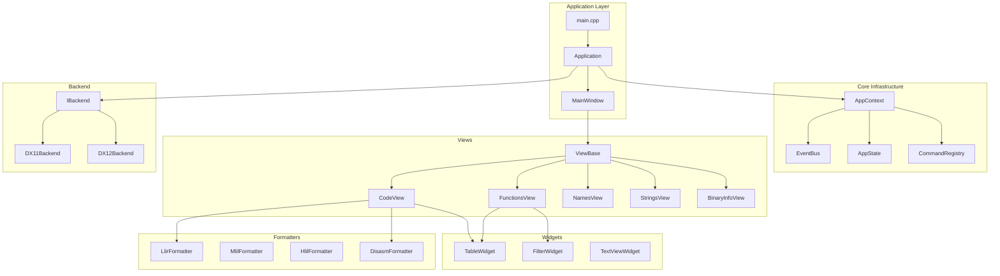

# ImGui 客户端彻底重构架构设计

## 1. 概述

本文档描述了 `clients/imgui` 模块的彻底重构计划，目标是引入现代 GUI 架构模式，包括事件驱动、状态管理和组件化设计。

### 1.1 clients/common 已有功能复用

**重要**：`clients/common` 已实现大量可复用功能，重构应直接使用而非重复实现：

| 模块 | 已有功能 | 使用方式 |
|------|----------|----------|
| `client::fmt::*` (ir.h) | LLIR/MLIL/HLIL 完整格式化 | 直接调用，替换 view_window.cpp 中 500 行重复代码 |
| `client::fmt::*` (address.h) | `hex()`, `parse_u64()`, `to_lower()`, `matches_filter()` | 替换所有重复定义 |
| `client::fmt::*` (symbols.h) | `symbol_display_name()` | 替换 functions_view 中的重复实现 |
| `client::CommandRegistry` | 命令注册系统 | 可扩展用于 GUI 快捷键/命令 |
| `client::Output` | 输出抽象 | 用于日志/输出视图 |

### 1.2 当前问题总结

| 问题 | 影响 | 严重程度 |
|------|------|----------|
| 单文件代码过大（view_window.cpp 1110行） | 难以维护和扩展 | 高 |
| **未复用 clients/common 中的格式化器** | 约500行重复代码 | 高 |
| 重复的辅助函数散落各处 | 代码冗余，不一致 | 中 |
| UiState巨大嵌套结构体 | 高耦合，难以测试 | 高 |
| 缺乏视图基类和事件系统 | 代码重复，扩展困难 | 高 |
| 视图间直接引用通信 | 紧耦合，难以重构 | 中 |

### 1.2 重构目标

- **模块化**：每个组件职责单一，可独立测试
- **可扩展**：添加新视图/功能只需最小改动
- **可维护**：清晰的代码结构和命名规范
- **解耦**：通过事件系统实现视图间通信
- **复用**：提取通用组件和工具函数

---

## 2. 新架构设计

### 2.1 目录结构

```
clients/imgui/
├── app/                          # 应用程序核心
│   ├── application.h             # 应用程序类声明
│   ├── application.cpp           # 应用程序生命周期管理
│   ├── main_window.h             # 主窗口/Dockspace管理
│   ├── main_window.cpp
│   └── theme.h/cpp               # 主题/样式管理
│
├── backends/                     # 渲染后端（保留现有结构）
│   ├── backend.h                 # 后端抽象接口
│   ├── dx11_backend.h/cpp        # 重构自 win32_dx11.cpp
│   └── dx12_backend.h/cpp        # 重构自 win32_dx12.cpp
│
├── core/                         # 核心基础设施
│   ├── event_bus.h               # 事件总线
│   ├── event_bus.cpp
│   ├── events.h                  # 事件类型定义
│   ├── state.h                   # 应用状态管理
│   ├── state.cpp
│   ├── commands.h                # 命令/动作系统
│   ├── commands.cpp
│   └── context.h                 # 应用上下文（DI容器）
│
├── utils/                        # 通用工具
│   ├── string_utils.h/cpp        # 字符串处理
│   ├── format_utils.h/cpp        # 格式化工具
│   └── imgui_helpers.h/cpp       # ImGui辅助函数
│
├── widgets/                      # 可复用UI组件
│   ├── widget_base.h             # Widget基类
│   ├── table_widget.h/cpp        # 通用表格
│   ├── text_view_widget.h/cpp    # 只读文本视图
│   ├── filter_widget.h/cpp       # 过滤器输入
│   ├── address_input.h/cpp       # 地址输入组件
│   └── toolbar_widget.h/cpp      # 工具栏组件
│
├── views/                        # 主要视图面板
│   ├── view_base.h               # 视图基类
│   ├── view_base.cpp
│   ├── binary_info/              # 二进制信息视图
│   │   ├── binary_info_view.h
│   │   ├── binary_info_view.cpp
│   │   ├── summary_tab.cpp
│   │   ├── segments_tab.cpp
│   │   ├── sections_tab.cpp
│   │   └── xrefs_tab.cpp
│   ├── code_view/                # 代码视图（原view_window）
│   │   ├── code_view.h
│   │   ├── code_view.cpp
│   │   ├── disasm_tab.h/cpp
│   │   └── ir_tabs.h/cpp         # LLIR/MLIL/HLIL/PseudoC标签页
│   ├── functions/
│   │   ├── functions_view.h
│   │   └── functions_view.cpp
│   ├── names/
│   │   ├── names_view.h
│   │   └── names_view.cpp
│   ├── strings/
│   │   ├── strings_view.h
│   │   └── strings_view.cpp
│   ├── output/
│   │   ├── output_view.h
│   │   └── output_view.cpp
│   └── file_browser/
│       ├── file_browser.h
│       └── file_browser.cpp
│
├── formatters/                   # IR/反汇编格式化
│   ├── formatter_base.h
│   ├── llir_formatter.h/cpp
│   ├── mlil_formatter.h/cpp
│   ├── hlil_formatter.h/cpp
│   ├── disasm_formatter.h/cpp
│   └── bytes_formatter.h/cpp
│
└── main.cpp                      # 入口点
```

### 2.2 核心架构图



---

## 3. 核心组件设计

### 3.1 事件系统（Event Bus）

采用类型安全的发布-订阅模式：

```cpp
// core/events.h
namespace client::events {

// 导航事件
struct NavigateToAddress {
    std::uint64_t address;
    bool open_in_new_tab = false;
};

// 会话事件
struct SessionOpened {
    std::string path;
};

struct SessionClosed {};

struct SessionReloaded {};

// 选择事件
struct FunctionSelected {
    std::uint64_t address;
    std::string name;
};

struct SymbolSelected {
    std::uint64_t address;
    std::string name;
};

// UI事件
struct RequestOpenFile {};
struct LayoutReset {};
struct ThemeChanged { std::string theme_name; };

}  // namespace client::events
```

```cpp
// core/event_bus.h
namespace client {

class EventBus {
public:
    using SubscriptionId = std::uint64_t;
    
    template<typename TEvent>
    SubscriptionId subscribe(std::function<void(const TEvent&)> handler);
    
    template<typename TEvent>
    void unsubscribe(SubscriptionId id);
    
    template<typename TEvent>
    void publish(const TEvent& event);
    
    // RAII订阅管理
    template<typename TEvent>
    class ScopedSubscription {
    public:
        ScopedSubscription(EventBus& bus, std::function<void(const TEvent&)> handler);
        ~ScopedSubscription();
    private:
        EventBus& bus_;
        SubscriptionId id_;
    };

private:
    std::unordered_map<std::type_index, std::vector<std::any>> handlers_;
    SubscriptionId next_id_ = 0;
};

}  // namespace client
```

### 3.2 应用状态管理（AppState）

集中管理应用状态，支持观察者模式：

```cpp
// core/state.h
namespace client {

// 导航状态
struct NavigationState {
    std::uint64_t current_address = 0;
    std::vector<std::uint64_t> history;
    int history_index = -1;
    
    void navigate_to(std::uint64_t address);
    bool can_go_back() const;
    bool can_go_forward() const;
    void go_back();
    void go_forward();
};

// 视图状态基类
struct ViewStateBase {
    bool visible = true;
    bool needs_refresh = false;
};

// 代码视图状态
struct CodeViewState : ViewStateBase {
    std::uint64_t address = 0;
    int instruction_count = 32;
    std::vector<engine::DisasmLine> disasm_cache;
    std::string last_error;
    // IR相关状态
    bool ir_built = false;
    std::vector<std::string> llir_lines;
    std::vector<std::string> mlil_lines;
    // ...
};

// 函数视图状态
struct FunctionsViewState : ViewStateBase {
    std::string filter;
    bool use_discovery = false;
    std::size_t selected_index = SIZE_MAX;
    std::vector<DiscoveredFunction> discovered;
};

// 应用总状态
class AppState {
public:
    // 会话管理
    engine::Session& session() { return session_; }
    const engine::Session& session() const { return session_; }
    bool is_session_loaded() const { return session_.loaded(); }
    
    // 导航
    NavigationState& navigation() { return navigation_; }
    
    // 各视图状态
    CodeViewState& code_view() { return code_view_; }
    FunctionsViewState& functions_view() { return functions_view_; }
    // ...
    
    // 状态变更通知
    void mark_dirty(ViewStateBase& view);
    
private:
    engine::Session session_;
    NavigationState navigation_;
    CodeViewState code_view_;
    FunctionsViewState functions_view_;
    // ...
};

}  // namespace client
```

### 3.3 应用上下文（依赖注入容器）

```cpp
// core/context.h
namespace client {

class AppContext {
public:
    AppContext();
    ~AppContext();
    
    // 核心服务访问
    EventBus& event_bus() { return event_bus_; }
    AppState& state() { return state_; }
    CommandRegistry& commands() { return commands_; }
    
    // 引擎信息
    const engine::EngineInfo& engine_info() const { return engine_info_; }
    
private:
    engine::EngineInfo engine_info_;
    EventBus event_bus_;
    AppState state_;
    CommandRegistry commands_;
};

}  // namespace client
```

### 3.4 视图基类

```cpp
// views/view_base.h
namespace client {

class ViewBase {
public:
    explicit ViewBase(AppContext& context, const char* name);
    virtual ~ViewBase() = default;
    
    // 生命周期
    virtual void on_attach() {}   // 视图添加时调用
    virtual void on_detach() {}   // 视图移除时调用
    
    // 渲染
    void render();                 // 框架调用，处理可见性
    virtual void on_render() = 0; // 子类实现具体渲染
    
    // 属性
    const char* name() const { return name_; }
    bool is_visible() const { return visible_; }
    void set_visible(bool visible) { visible_ = visible; }
    bool* visible_ptr() { return &visible_; }
    
protected:
    AppContext& ctx() { return context_; }
    EventBus& events() { return context_.event_bus(); }
    AppState& state() { return context_.state(); }
    engine::Session& session() { return state().session(); }
    
    // 辅助方法
    void navigate_to(std::uint64_t address);
    void show_error(const std::string& message);
    
private:
    AppContext& context_;
    const char* name_;
    bool visible_ = true;
};

}  // namespace client
```

### 3.5 Widget 基类

```cpp
// widgets/widget_base.h
namespace client {

template<typename TState>
class WidgetBase {
public:
    explicit WidgetBase(const char* id) : id_(id) {}
    virtual ~WidgetBase() = default;
    
    virtual void render(TState& state) = 0;
    
protected:
    const char* id() const { return id_; }
    std::string make_id(const char* suffix) const;
    
private:
    const char* id_;
};

}  // namespace client
```

---

## 4. 具体视图重构

### 4.1 CodeView（原 view_window）

拆分为多个子组件：

```cpp
// views/code_view/code_view.h
namespace client {

class CodeView : public ViewBase {
public:
    explicit CodeView(AppContext& context);
    
    void on_attach() override;
    void on_detach() override;
    void on_render() override;
    
private:
    void render_toolbar();
    void render_tabs();
    
    // 子标签页
    DisasmTab disasm_tab_;
    IrTabs ir_tabs_;
    
    // 事件订阅
    EventBus::ScopedSubscription<events::NavigateToAddress> nav_sub_;
};

// views/code_view/disasm_tab.h
class DisasmTab {
public:
    explicit DisasmTab(AppContext& context);
    void render(CodeViewState& state);
    
private:
    void refresh_disasm(CodeViewState& state, std::uint64_t address);
    void render_disasm_list(CodeViewState& state);
    void render_bytes_view(CodeViewState& state);
    
    AppContext& context_;
    DisasmFormatter formatter_;
    BytesFormatter bytes_formatter_;
};

// views/code_view/ir_tabs.h
class IrTabs {
public:
    explicit IrTabs(AppContext& context);
    void render(CodeViewState& state);
    
private:
    void render_llir_tab(CodeViewState& state);
    void render_mlil_tab(CodeViewState& state);
    void render_hlil_tab(CodeViewState& state);
    void render_pseudoc_tab(CodeViewState& state);
    
    void refresh_ir(CodeViewState& state, std::uint64_t address);
    
    AppContext& context_;
    LlirFormatter llir_formatter_;
    MlilFormatter mlil_formatter_;
    HlilFormatter hlil_formatter_;
};

}  // namespace client
```

### 4.2 FunctionsView

```cpp
// views/functions/functions_view.h
namespace client {

class FunctionsView : public ViewBase {
public:
    explicit FunctionsView(AppContext& context);
    
    void on_render() override;
    
private:
    void render_toolbar();
    void render_discovery_options();
    void render_functions_table();
    
    void discover_functions();
    void on_function_selected(std::size_t index);
    
    FilterWidget filter_widget_;
    TableWidget table_widget_;
};

}  // namespace client
```

---

## 5. Formatters 设计

将 IR 格式化逻辑从 UI 代码中提取：

```cpp
// formatters/formatter_base.h
namespace client {

class FormatterBase {
public:
    virtual ~FormatterBase() = default;
    
    struct Options {
        bool show_addresses = true;
        bool show_comments = true;
        int indent_size = 4;
    };
    
    void set_options(const Options& options) { options_ = options; }
    const Options& options() const { return options_; }
    
protected:
    std::string format_hex(std::uint64_t value) const;
    std::string make_indent(int level) const;
    
    Options options_;
};

// formatters/llir_formatter.h
class LlirFormatter : public FormatterBase {
public:
    void format_function(const engine::llir::Function& function, 
                         std::vector<std::string>& output);
    
private:
    std::string format_expr(const engine::llir::LlilExpr& expr);
    std::string format_stmt(const engine::llir::LlilStmt& stmt);
    std::string format_reg(const engine::llir::RegRef& reg);
    std::string format_var(const engine::llir::VarRef& var);
    const char* op_name(engine::llir::LlilOp op);
};

// formatters/mlil_formatter.h
class MlilFormatter : public FormatterBase {
public:
    void format_function(const engine::mlil::Function& function,
                         std::vector<std::string>& output);
    
private:
    std::string format_expr(const engine::mlil::MlilExpr& expr);
    std::string format_stmt(const engine::mlil::MlilStmt& stmt);
    std::string format_var(const engine::mlil::VarRef& var);
    const char* op_name(engine::mlil::MlilOp op);
};

// formatters/hlil_formatter.h  
class HlilFormatter : public FormatterBase {
public:
    void format_function(const engine::hlil::Function& function,
                         std::vector<std::string>& output);
    
private:
    void emit_stmt_block(const std::vector<engine::hlil::HlilStmt>& stmts,
                         int indent,
                         std::vector<std::string>& output);
    std::string format_stmt(const engine::hlil::HlilStmt& stmt, int indent);
    std::string format_expr(const engine::hlil::Expr& expr);
};

}  // namespace client
```

---

## 6. 通用工具函数

```cpp
// utils/string_utils.h
namespace client::utils {

std::string to_lower(std::string_view input);
bool contains_ignore_case(std::string_view haystack, std::string_view needle);
std::vector<std::string> split(std::string_view input, char delimiter);

}  // namespace client::utils

// utils/format_utils.h
namespace client::utils {

std::string format_hex(std::uint64_t value);
std::string format_size(std::uint64_t bytes);
std::string format_address_list(const std::vector<std::uint64_t>& addresses);
std::string join_lines(const std::vector<std::string>& lines);

}  // namespace client::utils

// utils/imgui_helpers.h
namespace client::imgui {

void render_readonly_text(const char* label, 
                          std::string_view text, 
                          const ImVec2& size);

void render_error_text(std::string_view message);
void render_info_text(std::string_view message);

bool address_input(const char* label, 
                   char* buffer, 
                   std::size_t buffer_size,
                   std::uint64_t* parsed_value = nullptr);

void copy_to_clipboard(std::string_view text);

// 表格辅助
void table_setup_columns(std::initializer_list<std::pair<const char*, float>> columns);

}  // namespace client::imgui
```

---

## 7. 渲染后端抽象

```cpp
// backends/backend.h
namespace client {

struct BackendConfig {
    const wchar_t* window_class = nullptr;
    const wchar_t* window_title = nullptr;
    int initial_width = 1280;
    int initial_height = 720;
};

class IBackend {
public:
    virtual ~IBackend() = default;
    
    virtual bool init(HWND hwnd) = 0;
    virtual void shutdown() = 0;
    virtual void new_frame() = 0;
    virtual void render() = 0;
    virtual void resize(UINT width, UINT height) = 0;
    
    virtual const BackendConfig& config() const = 0;
};

std::unique_ptr<IBackend> create_dx11_backend();
std::unique_ptr<IBackend> create_dx12_backend();
std::unique_ptr<IBackend> create_best_available_backend();

}  // namespace client
```

---

## 8. 主应用程序

```cpp
// app/application.h
namespace client {

class Application {
public:
    Application();
    ~Application();
    
    bool init(HINSTANCE instance);
    int run();
    void shutdown();
    
private:
    bool init_backend();
    bool init_imgui();
    bool init_views();
    
    void main_loop();
    void render_frame();
    void handle_events();
    
    std::unique_ptr<IBackend> backend_;
    std::unique_ptr<AppContext> context_;
    std::unique_ptr<MainWindow> main_window_;
    
    HWND hwnd_ = nullptr;
    bool running_ = false;
};

}  // namespace client

// app/main_window.h
class MainWindow {
public:
    explicit MainWindow(AppContext& context);
    
    void render();
    void reset_layout();
    
    // 视图管理
    void add_view(std::unique_ptr<ViewBase> view);
    ViewBase* find_view(const char* name);
    
private:
    void render_menu_bar();
    void render_toolbar();
    void render_dockspace();
    void render_views();
    void render_popups();
    
    AppContext& context_;
    std::vector<std::unique_ptr<ViewBase>> views_;
    
    ImGuiID dockspace_id_ = 0;
    bool dock_initialized_ = false;
    bool show_about_ = false;
};
```

---

## 9. xmake.lua 更新

```lua
if is_plat("windows") and has_config("with_imgui_client") then
    target("imgui_client")
        set_kind("binary")
        add_deps("engine", "client_common")
        add_packages("imgui")
        
        -- 应用程序核心
        add_files("clients/imgui/main.cpp")
        add_files("clients/imgui/app/*.cpp")
        
        -- 核心基础设施
        add_files("clients/imgui/core/*.cpp")
        
        -- 工具函数
        add_files("clients/imgui/utils/*.cpp")
        
        -- Widgets
        add_files("clients/imgui/widgets/*.cpp")
        
        -- 视图
        add_files("clients/imgui/views/*.cpp")
        add_files("clients/imgui/views/**/*.cpp")
        
        -- 格式化器
        add_files("clients/imgui/formatters/*.cpp")
        
        -- 后端
        add_files("clients/imgui/backends/*.cpp")
        
        -- 包含目录
        add_includedirs("clients/imgui")
        
        add_links("d3d11", "d3d12", "dxgi")
end
```

---

## 10. 迁移策略

### 阶段 1：基础设施搭建
1. 创建目录结构
2. 实现 EventBus
3. 实现 AppContext 和 AppState
4. 实现工具函数（utils/）
5. 创建后端抽象

### 阶段 2：组件化
1. 实现 ViewBase 基类
2. 实现通用 Widgets
3. 提取 Formatters

### 阶段 3：视图迁移
1. 迁移 CodeView（原 view_window）
2. 迁移 FunctionsView
3. 迁移 NamesView
4. 迁移 StringsView
5. 迁移 BinaryInfoView
6. 迁移 FileBrowser

### 阶段 4：整合与清理
1. 实现 MainWindow
2. 实现 Application
3. 更新 xmake.lua
4. 删除旧文件
5. 测试和修复

---

## 11. 风险与注意事项

1. **渐进式迁移**：可以先实现新架构，然后逐步迁移各视图
2. **保持功能不变**：每个阶段完成后应能编译运行
3. **性能考虑**：事件系统不应引入明显开销
4. **向后兼容**：保持与 engine 库的接口不变

---

## 12. 预期收益

| 方面 | 改进 |
|------|------|
| 代码量 | 每个文件控制在 200-300 行 |
| 可维护性 | 职责单一，易于理解 |
| 可扩展性 | 添加新视图只需继承 ViewBase |
| 可测试性 | 状态与渲染分离 |
| 代码复用 | Formatters、Widgets 可复用 |